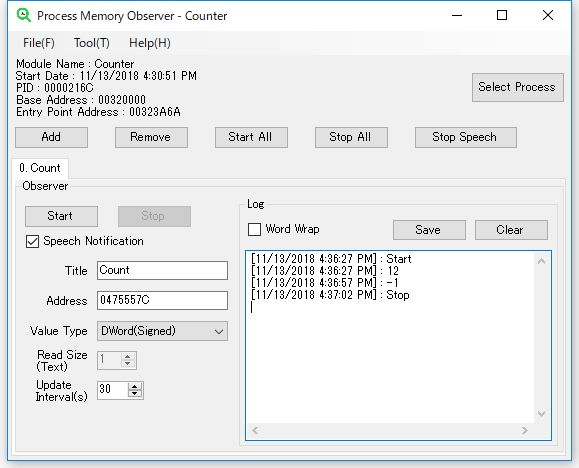

# Process Memory Observer

## Overview
This application observes the value of memory address that the selected process has.

You can use the feature that is recording log and text-to-speech notification.

This application do not have the feature that searches memory addresses. You need to prepare for a tool that can search memory addresses.

## System Requirements
Microsoft Windows 7 SP1 or later and .NET Framework 4.5.2 Runtime

## Usage
<a href="https://tkpphr.github.io/ProcessMemoryObserver/Docs/manual.html">Open manual</a>

## License
Released under the Apache 2.0 License.
See LICENSE.txt File.

This application uses third-party resources.
See details at <a href="https://tkpphr.github.io/ProcessMemoryObserver/Docs/notices.html">here</a>.